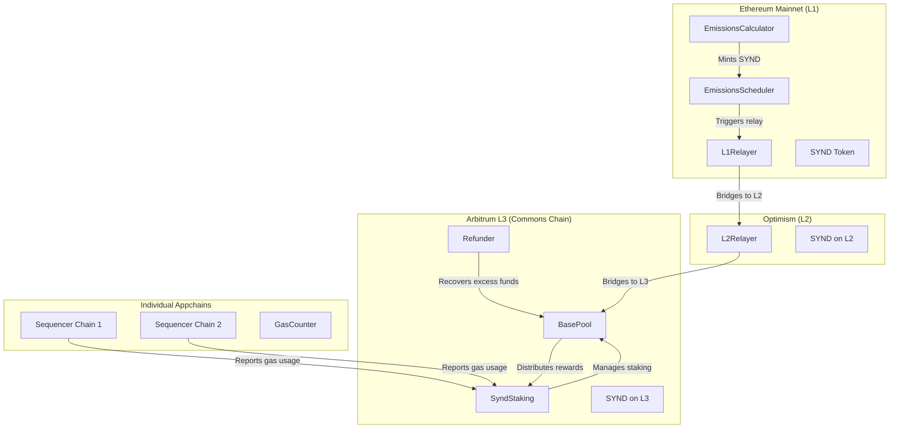

# Staking & Emissions System Audit Guide

- [System Overview](#system-overview)
- [Architecture & Multi-Chain Flow](#architecture--multi-chain-flow)
- [Core Components](#core-components)
- [Token Economics](#token-economics)
- [Cross-Chain Operations](#cross-chain-operations)
- [Security Considerations](#security-considerations)

---

## System Overview

The Syndicate Protocol implements a **multi-chain staking and emissions system** designed to incentivize participation in appchain sequencing while distributing rewards through a sophisticated cross-chain architecture.

### Key Features:

- **Multi-chain staking**: Stake SYND tokens across different appchains
- **Geometric decay emissions**: 80M SYND distributed over 48 epochs (4 years)
- **Cross-chain bridging**: Automated reward distribution via L2 OP chain → Arbitrum L3 chain
- **Gas-based rewards**: Reward sequencers based on actual gas consumption
- **Pro-rata accounting**: Fair reward distribution for partial epoch participation

---

## Architecture & Multi-Chain Flow



### Chain Responsibilities:

#### **Ethereum Mainnet (L1)**

- **Purpose**: Emissions calculation and initial token minting
- **Key Contracts**: `EmissionsCalculator`, `EmissionsScheduler`, `L1Relayer`
- **Role**: Calculates epoch emissions using geometric decay formula and triggers cross-chain distribution

#### **Optimism (L2)**

- **Purpose**: Intermediate bridging layer
- **Key Contracts**: `L2Relayer`
- **Role**: Receives SYND from L1 and bridges to final destination (L3)

#### **Arbitrum L3 (Commons Chain)**

- **Purpose**: Main staking and reward distribution hub
- **Key Contracts**: `SyndStaking`, `BasePool`, `Refunder`
- **Role**: Manages all staking operations, epoch tracking, and reward distribution

#### **Individual Appchains**

- **Purpose**: Transaction sequencing and gas tracking
- **Key Components**: Contracts inheriting `GasCounter`
- **Role**: Track gas consumption for reward calculations

---

## Core Components

### 1. Emissions System (`EmissionsCalculator` + `EmissionsScheduler`)

**Location**: Ethereum Mainnet

**Purpose**: Calculate and distribute 80M SYND tokens over 48 epochs using piece-wise geometric decay.

#### Mathematical Formula:

```
For epochs 0-46: E_t = R_t × (1 - r_t) / (1 - P_t)
For epoch 47:    E_t = R_t (sweep remaining)

Where:
- R_t = Remaining supply (80M - already emitted)
- r_t = Decay factor for epoch t (governance-adjustable)
- P_t = Cumulative product of decay factors from t to 47
```

#### Key Features:

- **Flexible decay factors**: Governance can adjust future emission curves
- **Sequential minting**: Epochs must be minted in order
- **Epoch synchronization**: Prevents timing attacks and ensures consistency

### 2. Staking System (`SyndStaking`)

**Location**: Arbitrum L3 (Commons Chain)

**Purpose**: Manage multi-dimensional stake tracking across users, epochs, and appchains.

#### Staking Dimensions:

1. **Global**: Total stake across all users/appchains
2. **Per-User**: User's total stake across all appchains
3. **Per-Appchain**: Total stake for specific appchain
4. **Per-User-Per-Appchain**: User's stake on specific appchain

#### 5-Variable Tracking Pattern:

For each dimension, the contract tracks:

1. **Current Total**: Present amount
2. **Historical Total**: Per-epoch snapshots
3. **Epoch Additions**: Amount added during epoch
4. **Epoch Withdrawals**: Amount withdrawn during epoch
5. **Last Finalized Epoch**: Tracks processed epochs

#### Pro-Rata Accounting:

```solidity
stakeShare = amount × (epochEnd - block.timestamp) / EPOCH_DURATION
```

Users who stake mid-epoch receive proportional rewards based on time remaining.

### 3. Reward Distribution (`BasePool`)

**Location**: Arbitrum L3 (Commons Chain)

**Purpose**: Distribute epoch rewards to stakers based on their proportional stake.

#### Reward Formula:

```
userReward = (epochRewardTotal × userStakeShare) / totalStakeShare
```

#### Key Features:

- **Pro-rata distribution**: Fair rewards based on stake proportion
- **Claim-based system**: Users actively claim rewards
- **Multi-epoch support**: Handle rewards for multiple epochs
- **Authorized claiming**: Staking contract can claim on behalf of users

### 4. Gas Tracking (`GasCounter`)

**Location**: Individual Appchains

**Purpose**: Track gas consumption for sequencer reward calculations.

#### Gas Calculation:

```solidity
gasTokens = gasUsed × tx.gasprice
```

#### Integration:

- Inherited by sequencing contracts
- Automatically tracks gas via `trackGasUsage` modifier
- Reports consumption per epoch for reward distribution

### 5. Cross-Chain Bridge System

#### **L1Relayer** (Ethereum → Optimism)

- Deposits SYND tokens to Optimism bridge
- Sends cross-chain message to trigger L2 operations
- Uses configurable gas limits for reliable execution

#### **L2Relayer** (Optimism → Arbitrum L3)

- Creates retryable tickets on Arbitrum bridge
- Handles token bridging with contract call execution
- Automatically deposits tokens to reward pools

#### **Refunder** (L3)

- Recovers excess funds from failed bridge operations
- Automatically deposits recovered funds to reward pools
- Provides safety net for cross-chain operations

---

## Token Economics

### Emission Schedule

- **Total Emissions**: 80,000,000 SYND
- **Duration**: 48 epochs (30 days each = ~4 years)
- **Start**: Epoch 2 (October 1st, 2025)
- **Distribution Method**: Geometric decay with governance-adjustable factors

### Staking Mechanics

- **Multi-chain staking**: Stake on multiple appchains simultaneously
- **Restaking**: Move stake between appchains without withdrawal delay
- **Withdrawal delay**: One epoch delay for security (30 days)
- **Epoch participation**: Pro-rata rewards for partial epoch participation

### Reward Distribution

- **Gas-based rewards**: Sequencers rewarded based on actual gas consumption
- **Stake-based rewards**: General staking rewards distributed pro-rata
- **Cross-chain delivery**: Automated reward bridging from L1 to L3

---

## Cross-Chain Operations

### Typical Emission & Distribution Flow:

1. **Epoch Trigger** (Anyone can call)

   ```solidity
   EmissionsScheduler.mintEmission(epochIndex)
   ```

2. **Emission Calculation** (Mainnet)

   ```solidity
   EmissionsCalculator.calculateAndMintEmission(relayer, expectedEpoch)
   ```

3. **L1 → L2 Bridge** (Automatic)

   ```solidity
   L1Relayer.relay(destination, epochIndex)
   // Triggers: depositERC20To + sendMessage
   ```

4. **L2 → L3 Bridge** (Automatic)

   ```solidity
   L2Relayer.relay(destination, epochIndex)
   // Creates: unsafeCreateRetryableTicket
   ```

5. **L3 Pool Deposit** (Automatic)

   ```solidity
   BasePool.deposit(epochIndex)
   // Funds available for staker claims
   ```

6. **User Claims** (User-initiated)
   ```solidity
   SyndStaking.claimAllRewards(claims, destination)
   ```

### Security Features:

- **Sequential processing**: Epochs must be processed in order
- **Retry mechanisms**: Arbitrum retryable tickets for failed executions
- **Fund recovery**: Refunder contract handles excess/failed bridge funds
- **Access controls**: Role-based permissions for critical operations

---

## Security Considerations

### Access Control

- **DEFAULT_ADMIN_ROLE**: Contract upgrades, critical parameter changes
- **DECAY_MANAGER_ROLE**: Emission curve adjustments (governance)
- **EMISSIONS_ROLE**: Emission minting authorization
- **PAUSER_ROLE**: Emergency pause capabilities

### Reentrancy Protection

- **ReentrancyGuard**: Applied to all fund transfer operations
- **State-then-interact**: Updates state before external calls
- **Claim protection**: Prevents double-claiming of rewards

### Cross-Chain Security

- **Epoch synchronization**: Prevents timing-based attacks
- **Fund recovery**: Automatic handling of failed bridge operations
- **Gas price protection**: Handles zero gas price edge cases
- **Bridge validation**: Proper validation of cross-chain messages

### Mathematical Precision

- **Fixed-point arithmetic**: Scaled by 1e18 for precision
- **Division by zero protection**: Handles edge cases in emission calculations
- **Overflow protection**: Uses SafeMath patterns via Solidity 0.8.28

---
