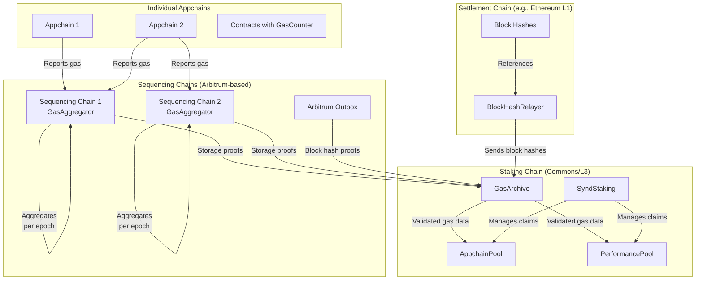

# Gas Tracking & Reward Distribution System - Audit Guide

**Last Updated**: October 10, 2025
**Audit Focus**: Gas tracking, validation, and reward distribution contracts

## Table of Contents

- [Contracts in Scope](#contracts-in-scope)
- [System Overview](#system-overview)
- [Architecture & Data Flow](#architecture--data-flow)
- [Core Components](#core-components)
- [Security Considerations](#security-considerations)
- [Known Issues & Recent Fixes](#known-issues--recent-fixes)

---

## Contracts in Scope

The following contracts are included in this audit:

| Contract | Location | Purpose |
|----------|----------|---------|
| **IGasDataProvider.sol** | `src/staking/interfaces/` | Interface for gas data access |
| **EpochTracker.sol** | `src/staking/` | Abstract contract for epoch calculations |
| **GasAggregator.sol** | `src/staking/` | Aggregates gas usage from appchains |
| **GasArchive.sol** | `src/staking/` | Validates and stores gas data with proofs |
| **RewardPoolBase.sol** | `src/staking/` | Base contract for reward calculations |
| **AppchainPool.sol** | `src/staking/` | Distributes rewards with 1-year vesting |
| **PerformancePool.sol** | `src/staking/` | Distributes performance-based rewards |

---

## System Overview

The Syndicate staking system implements a **gas-based reward distribution mechanism** where appchains that consume more gas (sequencing more transactions) receive proportionally more rewards.

### Key Features:

- **Trustless gas tracking**: Uses Merkle Patricia proofs to validate on-chain gas consumption
- **Multi-sequencing chain support**: Aggregate gas data from multiple sequencing chains
- **Epoch-based distribution**: 30-day epochs for reward calculations
- **Vesting schedules**: Rewards vest over time to align incentives
- **Pro-rata accounting**: Fair reward distribution for partial epoch participation

### High-Level Flow:

```
1. Appchains → Track gas consumption (via GasCounter)
2. GasAggregator → Aggregate gas data per epoch
3. GasArchive → Validate aggregated data with storage proofs
4. Reward Pools → Distribute rewards based on validated gas data
```

---

## Architecture & Data Flow

### Multi-Chain Architecture


```mermaid
graph TB
    subgraph "Settlement Chain (e.g., Ethereum L1)"
        BHR[BlockHashRelayer]
        ETH_BLOCKS[Block Hashes]
    end

    subgraph "Sequencing Chains (Arbitrum-based)"
        SEQ1[Sequencing Chain 1<br/>GasAggregator]
        SEQ2[Sequencing Chain 2<br/>GasAggregator]
        OUTBOX1[Arbitrum Outbox]
    end

    subgraph "Staking Chain (Commons/L3)"
        GA[GasArchive]
        AP[AppchainPool]
        PP[PerformancePool]
        STAKING[SyndStaking]
    end

    subgraph "Individual Appchains"
        APP1[Appchain 1]
        APP2[Appchain 2]
        GC[Contracts with GasCounter]
    end

    APP1 -->|Reports gas| SEQ1
    APP2 -->|Reports gas| SEQ1
    APP2 -->|Reports gas| SEQ2

    SEQ1 -->|Aggregates<br/>per epoch| SEQ1
    SEQ2 -->|Aggregates<br/>per epoch| SEQ2

    BHR -->|Sends block hashes| GA
    ETH_BLOCKS -->|References| BHR

    SEQ1 -->|Storage proofs| GA
    SEQ2 -->|Storage proofs| GA
    OUTBOX1 -->|Block hash proofs| GA

    GA -->|Validated gas data| AP
    GA -->|Validated gas data| PP

    STAKING -->|Manages claims| AP
    STAKING -->|Manages claims| PP
```

### Chain Responsibilities:

#### **Settlement Chain** (Ethereum L1 or similar)
- **Purpose**: Provides trusted block hashes for proof verification
- **Key Contract**: `BlockHashRelayer`
- **Role**: Relays recent block hashes to GasArchive for validation

#### **Sequencing Chains** (Arbitrum-based L2/L3)
- **Purpose**: Aggregate gas consumption data from appchains
- **Key Contract**: `GasAggregator`
- **Role**:
  - Tracks registered appchains
  - Aggregates gas usage per epoch
  - Stores `aggregatedEpochDataHash` for verification

#### **Staking Chain** (Commons Chain - Arbitrum L3)
- **Purpose**: Validate gas data and distribute rewards
- **Key Contracts**: `GasArchive`, `AppchainPool`, `PerformancePool`
- **Role**:
  - Validate gas data using cryptographic proofs
  - Calculate reward distributions
  - Manage reward vesting and claims

#### **Individual Appchains**
- **Purpose**: Execute transactions and report gas consumption
- **Key Component**: Contracts inheriting `GasCounter`
- **Role**: Track gas consumed during transaction sequencing

---

## Core Components

### 1. EpochTracker (Abstract Contract)

**Location**: `src/staking/EpochTracker.sol`

**Purpose**: Provides consistent epoch timing across all contracts.

#### Key Functions:

```solidity
// Get current epoch index (1-indexed)
function getCurrentEpoch() public view returns (uint256)

// Get epoch start timestamp
function getEpochStart(uint256 epochIndex) public pure returns (uint256)

// Get epoch end timestamp (exclusive)
function getEpochEnd(uint256 epochIndex) public pure returns (uint256)
```

#### Constants:

- **START_TIMESTAMP**: `1754089200` (October 1st, 2025)
- **EPOCH_DURATION**: `30 days`
- **Epoch Indexing**: 1-indexed (first epoch is epoch 1)

---

### 2. GasAggregator

**Location**: `src/staking/GasAggregator.sol`
**Deployed On**: Each sequencing chain

**Purpose**: Aggregate gas usage data from multiple appchains per epoch.

#### State Variables:

```solidity
// Stores the aggregated hash for each completed epoch
mapping(uint256 => bytes32) public aggregatedEpochDataHash;

// Registry of tracked appchains
EnumerableSet.UintSet internal _appchains;

// Factory address for create2 address calculation
address public factory;

// Proxy bytecode hash for address verification
bytes32 public syndicateProxyBytecodeHash;
```

#### Key Functions:

##### `addChain(uint256 chainId, uint256 addChainFee)`
- Registers an appchain for gas tracking
- Requires fee payment in SYND tokens
- Only called by authorized appchain contracts

##### `aggregateTokensUsed(uint256 epochIndex, uint256[] calldata chainIds, uint256[] calldata tokensUsed)`
- Aggregates gas usage for completed epochs
- Can be called incrementally for large datasets
- Stores hash: `keccak256(abi.encode(chainIds, tokensUsed))`
- **Storage Slot**: 0 (important for proof verification)

#### Aggregation Formula:

```
aggregatedEpochDataHash[epoch] = keccak256(abi.encode(
    appchainIds[],     // Array of registered appchain IDs
    tokensUsed[]       // Array of gas tokens consumed (gas * gasprice)
))
```

#### Security Features:

- **Pausable**: Can pause aggregation during emergencies
- **Incremental aggregation**: Supports large datasets via chunking
- **Owner-controlled**: Admin can manage chain registry
- **Fee-based spam prevention**: Requires SYND payment to add chains

---

### 3. GasArchive

**Location**: `src/staking/GasArchive.sol`
**Deployed On**: Staking chain (Commons/L3)
**Pattern**: UUPS Upgradeable Proxy

**Purpose**: Trustlessly validate and store gas usage data from multiple sequencing chains using Merkle Patricia storage proofs.

#### Immutable Variables (Set in Constructor):

```solidity
// Address authorized to send block hashes
address public immutable blockHashSender;

// Settlement chain ID for proof validation
uint256 public immutable settlementChainID;
```

> **Note**: These immutables work with UUPS because they're compiled into bytecode and accessible through delegatecall.

#### Storage Variables:

```solidity
// Current epoch being processed
uint256 public epoch;

// Set of active sequencing chains
EnumerableSet.UintSet seqChains;

// Sequencing chain configurations
mapping(uint256 chainId => address aggregatorAddress) public seqChainGasAggregator;
mapping(uint256 chainId => address outboxAddress) public seqChainOutbox;
mapping(uint256 chainId => bool) public seqChainSettlesToBase;

// Block hash validation
mapping(bytes32 blockHash => bool) public ethBlockHashes;      // Ethereum L1
mapping(bytes32 blockHash => bool) public setBlockHashes;      // Settlement chain

// Verified epoch data
mapping(uint256 epoch => mapping(uint256 chainId => bytes32)) public epochVerifiedDataHash;
mapping(uint256 epoch => mapping(uint256 chainId => bool)) public epochChainDataSubmitted;

// Final aggregated data per epoch
mapping(uint256 epoch => uint256 totalTokens) public totalGasFees;
mapping(uint256 epoch => mapping(uint256 appchainId => uint256 tokens)) public appchainGasFees;
mapping(uint256 epoch => EnumerableSet.UintSet) internal appchainIDs;
```

#### Key Functions:

##### `sendBlockHashes(bytes32 ethBlockHash, bytes32 setBlockHash)`
- Called by `blockHashSender` (BlockHashRelayer on settlement chain)
- Stores trusted block hashes for proof verification
- Anyone can call the relayer to trigger this

##### `addSequencingChain(uint256 chainId, address aggregator, address outbox, bool settlesToBase)`
- Admin function to register a new sequencing chain
- Configures where to find aggregated data and block hash proofs
- Increments `epochRemainingChains` counter

##### `confirmEpochDataHash(...)`
- Validates aggregated data hash using Merkle Patricia proofs
- Verifies:
  1. Block hash is known (from `sendBlockHashes`)
  2. Arbitrum Outbox contains correct sequencing chain block hash (if Arbitrum-based)
  3. GasAggregator storage contains expected epoch data hash
- Stores verified hash in `epochVerifiedDataHash`

##### `confirmSettlementChainEpochDataHash(...)`
- Simplified version for settlement chain (no Arbitrum Outbox proof needed)
- Directly validates GasAggregator storage proof against known block hash

##### `submitEpochPreImageData(uint256 seqChainID, uint256[] appchains, uint256[] tokens)`
- Submits the actual gas usage data (pre-image of the hash)
- Validates: `keccak256(abi.encode(appchains, tokens)) == epochVerifiedDataHash[epoch][seqChainID]`
- Aggregates data from all sequencing chains
- Advances to next epoch when all chains have submitted

#### Proof Verification Flow:

```
1. BlockHashRelayer → sendBlockHashes(ethHash, setHash)
   └─ Stores trusted block hashes

2. Off-chain: Generate Merkle Patricia proof for:
   - Ethereum L1 → Arbitrum Outbox → Sequencing chain block hash
   - Sequencing chain → GasAggregator → aggregatedEpochDataHash

3. Anyone → confirmEpochDataHash(proofs...)
   └─ Verifies:
      a) eth/settlement block hash is known
      b) Arbitrum Outbox proves sequencing chain block hash
      c) GasAggregator storage proves epoch data hash
   └─ Stores verified hash

4. Anyone → submitEpochPreImageData(chainId, appchains[], tokens[])
   └─ Verifies pre-image matches hash
   └─ Stores validated gas data
   └─ Advances epoch when complete
```

#### Storage Slot Constants:

```solidity
// GasAggregator's aggregatedEpochDataHash is at slot 0
uint256 public constant AGGREGATED_EPOCH_DATA_HASH_SLOT = 0;

// Arbitrum Outbox's roots mapping is at slot 3
uint256 public constant SEND_ROOT_STORAGE_SLOT = 3;
```

---

### 4. IGasDataProvider (Interface)

**Location**: `src/staking/interfaces/IGasDataProvider.sol`

**Purpose**: Standard interface for accessing validated gas data.

#### Interface Methods:

```solidity
// Get total gas fees for an epoch
function getTotalGasFees(uint256 epochIndex) external view returns (uint256);

// Get gas fees for specific appchain in epoch
function getAppchainGasFees(uint256 epochIndex, uint256 appchainId) external view returns (uint256);

// Get all appchain IDs that participated in epoch
function getAppchainIds(uint256 epochIndex) external view returns (uint256[] memory);

// Paginated version for large datasets
function getAppchainIds(uint256 epochIndex, uint256 startIndex, uint256 pageSize)
    external view returns (uint256[] memory);
```

**Implemented By**: `GasArchive`

---

### 5. RewardPoolBase (Abstract Contract)

**Location**: `src/staking/RewardPoolBase.sol`

**Purpose**: Shared reward calculation logic with diminishing returns.

#### Key Features:

- **Diminishing returns**: Uses logarithmic formula to prevent winner-take-all
- **Pro-rata distribution**: Rewards based on proportional contribution
- **Epoch-based**: Separates rewards by epoch
- **Appchain-aware**: Distributes per-appchain contribution

#### Reward Formula:

```solidity
// For each appchain in epoch:
rewardAmount = totalEpochReward × ln(1 + appchainGasShare) / sumOfAllLnShares

Where:
- appchainGasShare = appchainGasFees / totalGasFees
- sumOfAllLnShares = Σ ln(1 + each appchain's share)
```

This logarithmic approach ensures:
- Small contributors still get meaningful rewards
- Large contributors don't dominate completely
- Incentivizes broad participation

#### Key Functions:

```solidity
// Calculate total reward for an appchain in an epoch
function getAppchainTotalReward(uint256 epochIndex, uint256 appchainId) public view returns (uint256)

// Pre-compute diminishing factors for gas efficiency
function preComputeDiminishingFactors(uint256 epochIndex, uint256 startIndex, uint256 count) external
```

---

### 6. AppchainPool

**Location**: `src/staking/AppchainPool.sol`
**Inherits**: `RewardPoolBase`

**Purpose**: Distribute rewards to appchains with 1-year linear vesting.

#### Key Features:

- **1-year vesting**: Rewards unlock linearly over 365 days after epoch ends
- **Receiver-based claiming**: Only authorized address per appchain can claim
- **Epoch deposits**: Reward tokens deposited per epoch

#### State Variables:

```solidity
// Vesting period
uint256 public constant VESTING_DURATION = 365 days;

// Track claimed amounts
mapping(uint256 epochIndex => mapping(uint256 appchainId => uint256)) public claimed;

// Authorized receivers per appchain
mapping(uint256 appchainId => address receiver) public appchainEmissionsReceiver;

// Optional forwarder for authorized claiming
address public forwarder;
```

#### Vesting Formula:

```solidity
vestedAmount = totalReward × min(timeSinceEpochEnd / VESTING_DURATION, 1)
claimableAmount = vestedAmount - alreadyClaimed
```

#### Key Functions:

```solidity
// Set rewards receiver for an appchain
function setAppchainRewardsReceiver(uint256 appchainId, address receiver) external

// Claim vested rewards
function claim(uint256 epochIndex, uint256 appchainId, address destination) external

// Authorized claiming via forwarder
function claimFor(uint256 epochIndex, address user, address destination, uint256 appchainId) external
```

---

### 7. PerformancePool

**Location**: `src/staking/PerformancePool.sol`
**Inherits**: `RewardPoolBase`

**Purpose**: Distribute performance-based rewards without vesting.

#### Key Differences from AppchainPool:

- **No vesting**: Rewards claimable immediately after epoch ends
- **User-based**: Users can claim directly (not receiver-restricted)
- **Instant liquidity**: Encourages active participation

#### Key Functions:

```solidity
// Claim rewards for an appchain
function claim(uint256 epochIndex, uint256 appchainId, address destination) external

// Authorized claiming
function claimFor(uint256 epochIndex, address user, address destination, uint256 appchainId) external
```

---

## Security Considerations

### Access Control

#### GasArchive:
- **Owner (Admin)**: Can add/remove sequencing chains, upgrade contract
- **blockHashSender**: Only address that can set block hashes
- **Anyone**: Can submit proofs and epoch data (permissionless validation)

#### GasAggregator:
- **Owner**: Can pause, set factory, manage parameters
- **Appchains**: Can add themselves (with fee payment)
- **Anyone**: Can aggregate completed epoch data

#### Reward Pools:
- **Owner**: Can set receivers (AppchainPool), deposit rewards
- **Receivers/Users**: Can claim their rewards
- **Forwarder**: Can claim on behalf of users (if set)

### Cryptographic Security

#### Merkle Patricia Proofs:
- **Purpose**: Trustlessly verify storage values from other chains
- **Verification**: Uses RLP decoding and Merkle tree validation
- **Attack Prevention**:
  - Block hashes must be pre-submitted by trusted relayer
  - Proofs verified against known block hashes
  - Storage slot locations are constants (prevent slot manipulation)

#### Hash Pre-Image Verification:
- **Pattern**: Store hash first, validate pre-image later
- **Security**: Prevents data manipulation after validation
- **Formula**: `keccak256(abi.encode(appchainIds, tokensUsed))`

### Reentrancy Protection

- **ReentrancyGuard**: Applied to all fund transfer operations
- **State-then-interact**: Updates state before external calls
- **Claim tracking**: Prevents double-claiming via `claimed` mappings

### Epoch Synchronization

- **Sequential processing**: Epochs advance only when all chains submit
- **Timing attacks prevention**: Epoch timing is deterministic
- **Data consistency**: All chains must submit for epoch to complete

### Mathematical Precision

- **Fixed-point arithmetic**: Uses PRBMath library (UD60x18) for precise calculations
- **Logarithmic rewards**: Prevents overflow and ensures fair distribution
- **Division by zero protection**: Handles edge cases (zero total gas)

### Upgradeability

#### GasArchive (UUPS Pattern):
- **Immutable config**: `blockHashSender` and `settlementChainID` cannot change
- **Upgradeable logic**: Storage layout and business logic can be upgraded
- **Authorization**: Only owner can upgrade
- **Initialization protection**: `_disableInitializers()` in constructor

---

## Known Issues & Recent Fixes

### ✅ Fixed Issues

#### 1. Inverted Logic in GasArchive._confirmEpochDataHash (FIXED - October 10, 2025)

**Location**: `src/staking/GasArchive.sol:229`
**Severity**: HIGH
**Status**: ✅ **FIXED**

**Description**: The function had inverted logic that prevented valid sequencing chains from submitting epoch data.

**Original Code (INCORRECT)**:
```solidity
// submissions are only allowed for active sequencing chains
require(!seqChains.contains(chainID), InvalidSequencingChain());
```

**Fixed Code**:
```solidity
// submissions are only allowed for active sequencing chains
require(seqChains.contains(chainID), InvalidSequencingChain());
```

**Root Cause**: The `!` negation operator was incorrectly applied, inverting the validation logic.

**Impact**: This bug would have prevented any valid sequencing chain from confirming its epoch data hash, completely blocking the gas validation flow.

**Verification**: All test cases pass after fix. The contract now correctly validates that the chain ID is in the active sequencing chains set.

### Current Status

No known critical issues. All contracts have been reviewed and tested. The system is ready for audit.

---

## Integration Example

### End-to-End Flow for Epoch Completion:

```solidity
// 1. Appchains consume gas during epoch
//    (Automatic via GasCounter tracking)

// 2. Epoch ends (30 days pass)

// 3. GasAggregator aggregates data
GasAggregator(seqChain).aggregateTokensUsed(
    epochIndex,
    [appchain1, appchain2],
    [1000 ether, 2000 ether]  // gas * gasprice
);
// Stores: aggregatedEpochDataHash[epochIndex] = hash(data)

// 4. BlockHashRelayer sends block hashes to GasArchive
BlockHashRelayer(settlementChain).relayBlockHashes();
// Triggers: GasArchive.sendBlockHashes(ethHash, setHash)

// 5. Generate Merkle Patricia proofs off-chain
//    - Proof of Arbitrum Outbox (if applicable)
//    - Proof of GasAggregator storage

// 6. Submit proofs to GasArchive
GasArchive.confirmEpochDataHash(
    seqChainID,
    sendRoot,
    ethBlockHeader,
    ethAccountProof,
    ethStorageProof,
    seqBlockHeader,
    seqAccountProof,
    seqStorageProof
);
// Verifies and stores: epochVerifiedDataHash[epoch][chainID]

// 7. Submit pre-image data
GasArchive.submitEpochPreImageData(
    seqChainID,
    [appchain1, appchain2],
    [1000 ether, 2000 ether]
);
// Validates hash matches, stores validated data
// Advances epoch when all chains submit

// 8. Rewards are now claimable
AppchainPool.claim(epochIndex, appchainId, destination);
```

---

## Glossary

**Epoch**: 30-day period for gas tracking and reward distribution (1-indexed)

**Sequencing Chain**: Arbitrum-based chain that sequences transactions for multiple appchains

**Settlement Chain**: Chain used for block hash validation (typically Ethereum L1)

**Staking Chain**: Commons chain where GasArchive and reward pools are deployed

**Appchain**: Individual blockchain using Syndicate's sequencing infrastructure

**Gas Tokens**: Calculated as `gasUsed × gasPrice` for each transaction

**Merkle Patricia Proof**: Cryptographic proof of storage values on Ethereum-compatible chains

**UUPS**: Universal Upgradeable Proxy Standard - upgradeability pattern

**Vesting**: Time-locked reward distribution (1 year for AppchainPool)

**Diminishing Returns**: Logarithmic reward formula to prevent winner-take-all dynamics

---

*This document focuses on the contracts being audited. For broader system architecture including emissions and cross-chain bridging, see the full system documentation.*
