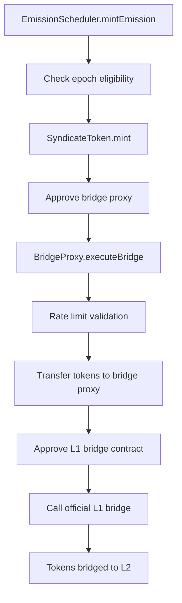

# SYND Token Architecture Documentation

## Overview

This document outlines the architecture and interaction patterns of the Syndicate Protocol token system deployed on Ethereum L1. The system consists of three primary components working together to provide automated token emissions with cross-chain bridging capabilities.

**For Auditors**: This document provides essential context for understanding the security model, access controls, and operational flow that must be properly configured for the system to function securely.

## System Components

### 1. SyndicateToken Contract (`SyndicateToken.sol`)

**Purpose**: The core ERC20 SYND token with governance and controlled minting capabilities.

**Key Features**:
- Standard ERC20 with 1 billion total supply
- ERC20Votes for governance participation
- ERC20Permit for gasless approvals
- Controlled emission minting (only by authorized scheduler)
- Transfer restrictions with unlock mechanism (for airdrop management)

**Supply Distribution**:
- **Initial Supply**: 900M tokens (90%) - minted to foundation at deployment
- **Emission Supply**: 100M tokens (10%) - minted over 4 years via emission scheduler

**Access Control Roles**:
```solidity
// Role for minting emission tokens (granted to EmissionScheduler)
bytes32 public constant EMISSION_MINTER_ROLE = keccak256("EMISSION_MINTER_ROLE");

// Role for airdrop management (transfer restrictions, emergency burns)
bytes32 public constant AIRDROP_MANAGER_ROLE = keccak256("AIRDROP_MANAGER_ROLE");

// OpenZeppelin DEFAULT_ADMIN_ROLE - full administrative control
```

### 2. SyndicateTokenEmissionScheduler Contract (`SyndicateTokenEmissionScheduler.sol`)

**Purpose**: Manages automated token emissions over a 4-year schedule with integrated L2 bridging.

**Key Features**:
- 48 epochs of 30 days each (~4 years total emission period)
- Decreasing emission amounts following a predetermined decay schedule
- Automated L2 bridging via configurable bridge proxies
- Comprehensive pause/resume functionality
- Bridge failure handling with atomic operations

**Emission Schedule**:
- **Total Epochs**: 48 epochs × 30 days = ~4 years
- **Total Emissions**: 100M tokens distributed across 8 periods of 6 epochs each
- **Decay Pattern**: Each period emits decreasing amounts
- **Bridge Integration**: All emissions automatically bridged to configured L2

**Access Control Roles**:
```solidity
// Role for starting/stopping emissions (typically governance)
bytes32 public constant EMISSIONS_MANAGER_ROLE = keccak256("EMISSIONS_MANAGER_ROLE");

// Role for emergency pausing (security response team)
bytes32 public constant PAUSER_ROLE = keccak256("PAUSER_ROLE");

// Role for bridge configuration (operations team)
bytes32 public constant BRIDGE_MANAGER_ROLE = keccak256("BRIDGE_MANAGER_ROLE");

// OpenZeppelin DEFAULT_ADMIN_ROLE - full administrative control
```

### 3. Bridge Proxy Contracts (`ArbitrumBridgeProxy.sol`, `OptimismBridgeProxy.sol`)

**Purpose**: Secure, rate-limited interfaces to official L1-L2 bridge contracts.

**Key Features**:
- Integration with official Arbitrum and Optimism bridge contracts
- Rate limiting (daily and per-transaction limits)
- Automated ETH gas fee management (Arbitrum)
- Configurable bridge parameters (recipients, gas limits)
- Comprehensive pause/resume functionality

**Bridge Targets**:
- **Arbitrum**: L1GatewayRouter (`0x72Ce9c846789fdB6fC1f34aC4AD25Dd9ef7031ef`)
- **Optimism**: L1StandardBridge (`0x99C9fc46f92E8a1c0deC1b1747d010903E884bE1`)

**Access Control Roles**:
```solidity
// Role for bridge administration (configuration, pause/unpause)
bytes32 public constant BRIDGE_ADMIN_ROLE = keccak256("BRIDGE_ADMIN_ROLE");

// Role for executing bridge operations (granted to EmissionScheduler)
bytes32 public constant BRIDGE_CALLER_ROLE = keccak256("BRIDGE_CALLER_ROLE");

// OpenZeppelin DEFAULT_ADMIN_ROLE - full administrative control
```

## Architecture Flow

### Complete Emission-to-Bridge Flow



### Detailed Component Interactions

1. **Emission Trigger**: `EmissionScheduler.mintEmission()` called by `EMISSIONS_MANAGER_ROLE`
2. **Token Minting**: Scheduler mints tokens from SyndicateToken using `EMISSION_MINTER_ROLE`
3. **Bridge Approval**: Scheduler approves bridge proxy for token amount
4. **Bridge Execution**: Scheduler calls `BridgeProxy.executeBridge()` using `BRIDGE_CALLER_ROLE`
5. **Rate Limiting**: Bridge proxy validates daily and per-transaction limits
6. **Token Transfer**: Bridge proxy receives tokens from scheduler
7. **L1 Bridge Call**: Bridge proxy calls official Arbitrum/Optimism bridge
8. **L2 Delivery**: Official bridge handles L2 token delivery

### Error Handling & Atomicity

**Atomic Operations**: If any step fails, the entire emission transaction reverts:
- No tokens are minted if bridging fails
- No partial state changes occur
- Emission epoch counter doesn't advance on failure

**Failure Recovery**: System includes pause mechanisms and manual intervention capabilities for handling bridge failures or other emergencies.

## Required Access Control Configuration

### Critical Security Setup

**⚠️ AUDIT FOCUS**: The following access control configuration is essential for system security:

#### 1. SyndicateToken Roles

```solidity
// REQUIRED: Grant emission minting capability to scheduler
syndicateToken.grantRole(EMISSION_MINTER_ROLE, address(emissionScheduler));

// OPTIONAL: Grant airdrop management (if using transfer restrictions)
syndicateToken.grantRole(AIRDROP_MANAGER_ROLE, airdropManagerAddress);

// REQUIRED: Set admin role (typically governance/multisig)
syndicateToken.grantRole(DEFAULT_ADMIN_ROLE, adminAddress);
```

#### 2. EmissionScheduler Roles

```solidity
// REQUIRED: Grant emissions management (start/stop emissions)
emissionScheduler.grantRole(EMISSIONS_MANAGER_ROLE, emissionsManagerAddress);

// REQUIRED: Grant pause capability (emergency response)
emissionScheduler.grantRole(PAUSER_ROLE, pauserAddress);

// REQUIRED: Grant bridge configuration management
emissionScheduler.grantRole(BRIDGE_MANAGER_ROLE, bridgeManagerAddress);

// REQUIRED: Set admin role (typically governance/multisig)
emissionScheduler.grantRole(DEFAULT_ADMIN_ROLE, adminAddress);
```

#### 3. Bridge Proxy Roles

```solidity
// REQUIRED: Grant bridge calling capability to emission scheduler
bridgeProxy.grantRole(BRIDGE_CALLER_ROLE, address(emissionScheduler));

// REQUIRED: Grant bridge administration
bridgeProxy.grantRole(BRIDGE_ADMIN_ROLE, bridgeAdminAddress);

// REQUIRED: Set admin role (typically governance/multisig)
bridgeProxy.grantRole(DEFAULT_ADMIN_ROLE, adminAddress);
```

### Configuration Dependencies

#### EmissionScheduler Configuration

```solidity
// REQUIRED: Configure bridge proxy for L2 emissions
emissionScheduler.setBridgeProxy(IBridgeProxy(bridgeProxyAddress));

// REQUIRED: Set bridge parameters (recipient, gas limits)
// Arbitrum: abi.encode(l2Recipient, maxGas, gasPriceBid)
// Optimism: abi.encode(l2Recipient, gasLimit)
emissionScheduler.setBridgeData(bridgeParameters);

// REQUIRED: Start emission schedule
emissionScheduler.startEmissions();
```

#### Bridge Proxy Configuration

```solidity
// REQUIRED: Configure rate limits
bridgeProxy.setMaxSingleTransfer(maxPerTransaction);
bridgeProxy.setDailyLimit(maxPerDay);

// REQUIRED: Ensure bridge proxy has ETH for gas (Arbitrum only)
// ETH needed = maxGas * gasPriceBid per transaction
```

## Security Considerations

### Access Control Security Model

1. **Principle of Least Privilege**: Each role has minimal necessary permissions
2. **Role Separation**: Different entities control different aspects (emissions, bridges, emergency pause)
3. **Multi-layer Validation**: Rate limits, approval mechanisms, and atomic operations
4. **Emergency Controls**: Pause mechanisms at multiple levels

### Critical Security Assumptions

**⚠️ AUDIT ATTENTION**: These assumptions must hold for system security:

1. **Admin Key Security**: `DEFAULT_ADMIN_ROLE` holders must be secure (recommend multisig)
2. **Role Assignment Correctness**: All required roles must be properly assigned before operations
3. **Bridge Target Validation**: Bridge proxy targets must be verified official bridge contracts
4. **ETH Funding**: Arbitrum bridge proxy must maintain sufficient ETH for gas fees
5. **L2 Token Registration**: L2 tokens must be properly deployed and registered with bridges

### Operational Security

1. **Emission Schedule Immutability**: Once started, emission schedule cannot be modified
2. **Bridge Configuration**: Bridge parameters can be updated by `BRIDGE_MANAGER_ROLE`
3. **Emergency Pause**: Multiple actors can pause but only admin can unpause
4. **Rate Limiting**: Protects against excessive token transfers

## Pre-Deployment Checklist

### For Auditors: Verify These Configurations

- [ ] **Token Contract**: Admin roles assigned to secure addresses (multisig recommended)
- [ ] **Emission Scheduler**: All required roles assigned to appropriate entities
- [ ] **Bridge Proxies**: Caller role granted to emission scheduler
- [ ] **Bridge Targets**: Verified official Arbitrum/Optimism bridge addresses
- [ ] **Rate Limits**: Configured according to operational requirements
- [ ] **ETH Funding**: Arbitrum bridge proxy funded for gas fees
- [ ] **L2 Integration**: L2 tokens deployed and registered with respective bridges
- [ ] **Emergency Procedures**: Pause roles assigned to security response team

## Testing and Validation

The system includes comprehensive test suites:

- **Unit Tests**: Individual contract functionality
- **Integration Tests**: Complete emission-to-bridge flow
- **Mainnet Fork Tests**: Validation against real bridge contracts
- **Access Control Tests**: Role-based permission validation
- **Failure Scenario Tests**: Bridge failures, insufficient funds, rate limits

For testing purposes, the system provides mock contracts and detailed integration test examples in the `test/` directory.

## Governance Integration

The SyndicateToken implements ERC20Votes, enabling:
- Governance participation through token voting power
- Delegation of voting power
- Historical vote tracking via checkpoints

This allows the SYND token to integrate with governance systems like Governor contracts for decentralized protocol management.

---

**For Auditor Reference**: This architecture document should be used in conjunction with the individual contract documentation and comprehensive test suites to understand the complete system security model.