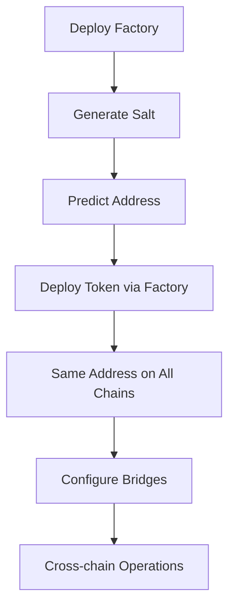
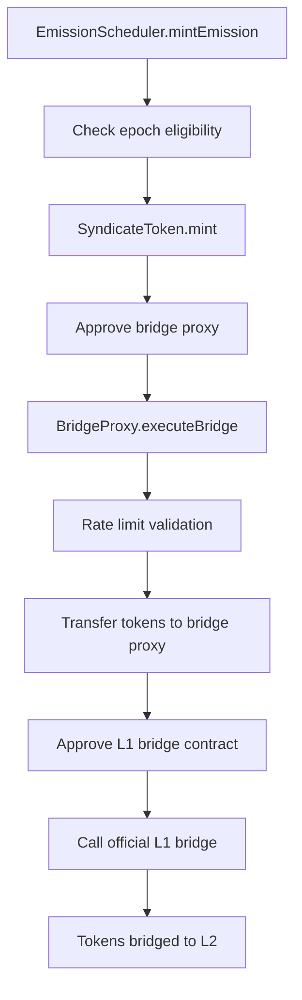
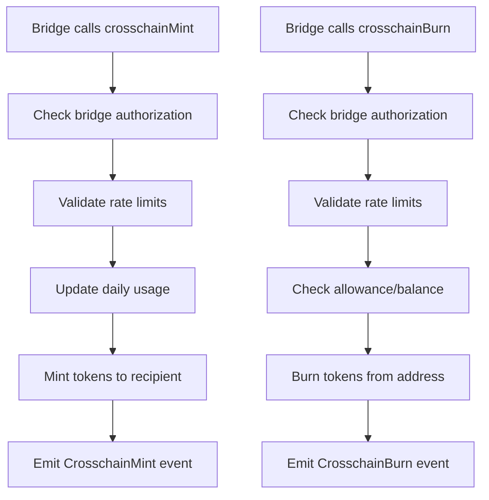

# SYND Token Architecture Documentation

## Overview

This document outlines the architecture and interaction patterns of the Syndicate Protocol token system. The system consists of core token contracts, crosschain variants, and supporting infrastructure for automated token emissions with cross-chain bridging capabilities.

**For Auditors**: This document provides essential context for understanding the security model, access controls, and operational flow that must be properly configured for the system to function securely.

## System Components

### 1. Core Token Contracts

#### SyndicateToken Contract (`SyndicateToken.sol`)

**Purpose**: The core ERC20 SYND token with governance and controlled minting capabilities.

**Key Features**:
- Standard ERC20 with 1 billion total supply
- ERC20Votes for governance participation
- ERC20Permit for gasless approvals
- Controlled emission minting (only by authorized scheduler)
- Transfer restrictions with unlock mechanism (for airdrop management)

**Supply Distribution**:
- **Initial Supply**: 900M tokens (90%) - minted to foundation at deployment
- **Emission Supply**: 100M tokens (10%) - minted over 4 years via emission scheduler

**Access Control Roles**:
```solidity
// Role for minting emission tokens (granted to EmissionScheduler)
bytes32 public constant EMISSION_MINTER_ROLE = keccak256("EMISSION_MINTER_ROLE");

// Role for airdrop management (transfer restrictions, emergency burns)
bytes32 public constant AIRDROP_MANAGER_ROLE = keccak256("AIRDROP_MANAGER_ROLE");

// OpenZeppelin DEFAULT_ADMIN_ROLE - full administrative control
```

#### TestnetSyndToken Contract (`TestnetSyndToken.sol`)

**Purpose**: Testnet version of the SYND token with simplified minting for development and testing.

**Key Features**:
- All features of SyndicateToken
- Additional MINTER_ROLE for flexible testnet minting
- No initial supply restrictions for testing flexibility

### 2. Crosschain Token Contracts

#### SyndicateTokenCrosschain Contract (`SyndicateTokenCrosschain.sol`)

**Purpose**: Production crosschain token extending SyndicateToken with ERC7802 compatibility.

**Key Features**:
- All features of SyndicateToken
- ERC7802 SuperChain compatibility (crosschainMint/crosschainBurn)
- Bridge rate limiting per authorized bridge
- XERC20-style bridge management
- ERC165 interface detection

**Crosschain Capabilities**:
```solidity
// ERC7802 interface for SuperChain compatibility
interface IERC7802 {
    function crosschainMint(address to, uint256 amount) external;
    function crosschainBurn(address from, uint256 amount) external;
}

// Bridge rate limiting interface
interface IBridgeRateLimiter {
    struct BridgeConfig {
        uint256 dailyMintLimit;
        uint256 dailyBurnLimit;
        uint256 lastMintTimestamp;
        uint256 lastBurnTimestamp;
        uint256 currentMintUsed;
        uint256 currentBurnUsed;
        bool isActive;
    }
}
```

**Access Control Roles**:
```solidity
// Role for managing bridge configurations
bytes32 public constant BRIDGE_MANAGER_ROLE = keccak256("BRIDGE_MANAGER_ROLE");

// Inherits all roles from SyndicateToken
```

#### TestnetSyndTokenCrosschain Contract (`TestnetSyndTokenCrosschain.sol`)

**Purpose**: Testnet crosschain token extending TestnetSyndToken with crosschain capabilities.

**Key Features**:
- All features of TestnetSyndToken
- Same crosschain capabilities as SyndicateTokenCrosschain
- Flexible minting for testnet environments

### 3. Crosschain Factory Contracts

#### SyndicateTokenCrosschainFactory Contract (`SyndicateTokenCrosschainFactory.sol`)

**Purpose**: Deploys SyndicateTokenCrosschain with deterministic addresses using Solmate CREATE3.

**Key Features**:
- CREATE3 deterministic deployment (same address on all chains)
- Salt generation based on admin, treasury, and chain ID
- Address prediction before deployment

**Deployment Functions**:
```solidity
function deploySyndicateTokenCrosschain(address admin, address treasury, bytes32 salt) 
    external returns (address token);

function predictTokenAddress(bytes32 salt) external view returns (address);

function generateSalt(address admin, address treasury, uint256 chainId) 
    external pure returns (bytes32);
```

#### TestnetSyndTokenCrosschainFactory Contract (`TestnetSyndTokenCrosschainFactory.sol`)

**Purpose**: Deploys TestnetSyndTokenCrosschain with deterministic addresses.

**Key Features**:
- Same CREATE3 capabilities as mainnet factory
- Tailored for testnet token deployment

### 4. Crosschain Infrastructure

#### Crosschain Interfaces (`src/token/crosschain/interfaces/`)

- **IERC7802.sol**: ERC-7802 Crosschain Fungibility Extension interface
- **IBridgeRateLimiter.sol**: Bridge rate limiting and management interface

#### Crosschain Libraries (`src/token/crosschain/libraries/`)

- **CREATE3.sol**: Solmate CREATE3 library for deterministic deployment
- **Bytes32AddressLib.sol**: Solmate utility for address conversion

### 5. SyndicateTokenEmissionScheduler Contract (`SyndicateTokenEmissionScheduler.sol`)

**Purpose**: Manages automated token emissions over a 4-year schedule with integrated L2 bridging.

**Key Features**:
- 48 epochs of 30 days each (~4 years total emission period)
- Decreasing emission amounts following a predetermined decay schedule
- Automated L2 bridging via configurable bridge proxies
- Comprehensive pause/resume functionality
- Bridge failure handling with atomic operations

**Emission Schedule**:
- **Total Epochs**: 48 epochs × 30 days = ~4 years
- **Total Emissions**: 100M tokens distributed across 8 periods of 6 epochs each
- **Decay Pattern**: Each period emits decreasing amounts
- **Bridge Integration**: All emissions automatically bridged to configured L2

**Access Control Roles**:
```solidity
// Role for starting/stopping emissions (typically governance)
bytes32 public constant EMISSIONS_MANAGER_ROLE = keccak256("EMISSIONS_MANAGER_ROLE");

// Role for emergency pausing (security response team)
bytes32 public constant PAUSER_ROLE = keccak256("PAUSER_ROLE");

// Role for bridge configuration (operations team)
bytes32 public constant BRIDGE_MANAGER_ROLE = keccak256("BRIDGE_MANAGER_ROLE");

// OpenZeppelin DEFAULT_ADMIN_ROLE - full administrative control
```

### 6. Bridge Proxy Contracts (`ArbitrumBridgeProxy.sol`, `OptimismBridgeProxy.sol`)

**Purpose**: Secure, rate-limited interfaces to official L1-L2 bridge contracts.

**Key Features**:
- Integration with official Arbitrum and Optimism bridge contracts
- Rate limiting (daily and per-transaction limits)
- Automated ETH gas fee management (Arbitrum)
- Configurable bridge parameters (recipients, gas limits, submission costs)
- Comprehensive pause/resume functionality
- Configurable maxSubmissionCost for Arbitrum bridging

**Bridge Targets**:
- **Arbitrum**: L1GatewayRouter (`0x72Ce9c846789fdB6fC1f34aC4AD25Dd9ef7031ef`)
- **Optimism**: L1StandardBridge (`0x99C9fc46f92E8a1c0deC1b1747d010903E884bE1`)

**Access Control Roles**:
```solidity
// Role for bridge administration (configuration, pause/unpause)
bytes32 public constant BRIDGE_ADMIN_ROLE = keccak256("BRIDGE_ADMIN_ROLE");

// Role for executing bridge operations (granted to EmissionScheduler)
bytes32 public constant BRIDGE_CALLER_ROLE = keccak256("BRIDGE_CALLER_ROLE");

// OpenZeppelin DEFAULT_ADMIN_ROLE - full administrative control
```

## Architecture Flows

### 1. Crosschain Token Deployment Flow



### 2. Complete Emission-to-Bridge Flow



### 3. Crosschain Token Bridge Flow



### Detailed Component Interactions

#### Emission Flow
1. **Emission Trigger**: `EmissionScheduler.mintEmission()` called by `EMISSIONS_MANAGER_ROLE`
2. **Token Minting**: Scheduler mints tokens from SyndicateToken using `EMISSION_MINTER_ROLE`
3. **Bridge Approval**: Scheduler approves bridge proxy for token amount
4. **Bridge Execution**: Scheduler calls `BridgeProxy.executeBridge()` using `BRIDGE_CALLER_ROLE`
5. **Rate Limiting**: Bridge proxy validates daily and per-transaction limits
6. **Token Transfer**: Bridge proxy receives tokens from scheduler
7. **L1 Bridge Call**: Bridge proxy calls official Arbitrum/Optimism bridge
8. **L2 Delivery**: Official bridge handles L2 token delivery

#### Crosschain Flow
1. **Bridge Authorization**: Bridge must have active configuration with rate limits
2. **Rate Limit Check**: Daily mint/burn limits validated and updated
3. **Token Operations**: Mint/burn executed with proper access controls
4. **Event Emission**: Crosschain events emitted for bridge tracking

### Error Handling & Atomicity

**Atomic Operations**: If any step fails, the entire transaction reverts:
- No tokens are minted if bridging fails
- No partial state changes occur
- Emission epoch counter doesn't advance on failure
- Rate limits only update on successful operations

**Failure Recovery**: System includes pause mechanisms and manual intervention capabilities for handling bridge failures or other emergencies.

## Required Access Control Configuration

### Critical Security Setup

**⚠️ AUDIT FOCUS**: The following access control configuration is essential for system security:

#### 1. SyndicateToken Roles

```solidity
// REQUIRED: Grant emission minting capability to scheduler
syndicateToken.grantRole(EMISSION_MINTER_ROLE, address(emissionScheduler));

// OPTIONAL: Grant airdrop management (if using transfer restrictions)
syndicateToken.grantRole(AIRDROP_MANAGER_ROLE, airdropManagerAddress);

// REQUIRED: Set admin role (typically governance/multisig)
syndicateToken.grantRole(DEFAULT_ADMIN_ROLE, adminAddress);
```

#### 2. Crosschain Token Roles

```solidity
// REQUIRED: Grant bridge management for crosschain operations
crosschainToken.grantRole(BRIDGE_MANAGER_ROLE, bridgeManagerAddress);

// REQUIRED: Set admin role (typically governance/multisig)
crosschainToken.grantRole(DEFAULT_ADMIN_ROLE, adminAddress);

// Inherits all SyndicateToken or TestnetSyndToken roles
```

#### 3. EmissionScheduler Roles

```solidity
// REQUIRED: Grant emissions management (start/stop emissions)
emissionScheduler.grantRole(EMISSIONS_MANAGER_ROLE, emissionsManagerAddress);

// REQUIRED: Grant pause capability (emergency response)
emissionScheduler.grantRole(PAUSER_ROLE, pauserAddress);

// REQUIRED: Grant bridge configuration management
emissionScheduler.grantRole(BRIDGE_MANAGER_ROLE, bridgeManagerAddress);

// REQUIRED: Set admin role (typically governance/multisig)
emissionScheduler.grantRole(DEFAULT_ADMIN_ROLE, adminAddress);
```

#### 4. Bridge Proxy Roles

```solidity
// REQUIRED: Grant bridge calling capability to emission scheduler
bridgeProxy.grantRole(BRIDGE_CALLER_ROLE, address(emissionScheduler));

// REQUIRED: Grant bridge administration
bridgeProxy.grantRole(BRIDGE_ADMIN_ROLE, bridgeAdminAddress);

// REQUIRED: Set admin role (typically governance/multisig)
bridgeProxy.grantRole(DEFAULT_ADMIN_ROLE, adminAddress);
```

### Configuration Dependencies

#### Factory Deployment Configuration

```solidity
// REQUIRED: Deploy factories on all target chains
SyndicateTokenCrosschainFactory factory = new SyndicateTokenCrosschainFactory();
TestnetSyndTokenCrosschainFactory testnetFactory = new TestnetSyndTokenCrosschainFactory();

// REQUIRED: Generate universal salt for consistent addressing
bytes32 salt = factory.generateSalt(admin, treasury, chainId);

// REQUIRED: Deploy tokens with same salt on each chain
address token = factory.deploySyndicateTokenCrosschain(admin, treasury, salt);
```

#### Crosschain Token Configuration

```solidity
// REQUIRED: Configure authorized bridges with rate limits
crosschainToken.setBridgeLimits(
    bridgeAddress,
    1_000_000 * 10**18,  // Daily mint limit
    1_000_000 * 10**18   // Daily burn limit
);

// REQUIRED: Activate bridge after configuration
// Bridge is automatically activated by setBridgeLimits
```

#### EmissionScheduler Configuration

```solidity
// REQUIRED: Configure bridge proxy for L2 emissions
emissionScheduler.setBridgeProxy(IBridgeProxy(bridgeProxyAddress));

// REQUIRED: Set bridge parameters (recipient, gas limits)
// Arbitrum: abi.encode(l2Recipient, maxGas, gasPriceBid)
// Optimism: abi.encode(l2Recipient, gasLimit)
emissionScheduler.setBridgeData(bridgeParameters);

// REQUIRED: Start emission schedule
emissionScheduler.startEmissions();
```

#### Bridge Proxy Configuration

```solidity
// REQUIRED: Configure rate limits
bridgeProxy.setMaxSingleTransfer(maxPerTransaction);
bridgeProxy.setDailyLimit(maxPerDay);

// REQUIRED: Ensure bridge proxy has ETH for gas (Arbitrum only)
// ETH needed = (maxGas * gasPriceBid) + maxSubmissionCost per transaction

// OPTIONAL: Configure Arbitrum-specific parameters
arbitrumBridgeProxy.setArbitrumConfig(l2Recipient, maxGas, gasPriceBid);
arbitrumBridgeProxy.setMaxSubmissionCost(maxSubmissionCost); // Default: 0.001 ETH

// OPTIONAL: Configure Optimism-specific parameters
optimismBridgeProxy.setOptimismConfig(l2Recipient, gasLimit);
```

## Security Considerations

### Access Control Security Model

1. **Principle of Least Privilege**: Each role has minimal necessary permissions
2. **Role Separation**: Different entities control different aspects (emissions, bridges, emergency pause)
3. **Multi-layer Validation**: Rate limits, approval mechanisms, and atomic operations
4. **Emergency Controls**: Pause mechanisms at multiple levels

### Critical Security Assumptions

**⚠️ AUDIT ATTENTION**: These assumptions must hold for system security:

1. **Admin Key Security**: `DEFAULT_ADMIN_ROLE` holders must be secure (recommend multisig)
2. **Role Assignment Correctness**: All required roles must be properly assigned before operations
3. **Bridge Target Validation**: Bridge proxy targets must be verified official bridge contracts
4. **ETH Funding**: Arbitrum bridge proxy must maintain sufficient ETH for gas fees and submission costs
5. **L2 Token Registration**: L2 tokens must be properly deployed and registered with bridges
6. **Factory Address Consistency**: Same factory address must be deployed on all chains for deterministic addressing
7. **Bridge Authorization**: Only authorized bridges can mint/burn crosschain tokens
8. **Rate Limit Enforcement**: Bridge rate limits must be properly configured to prevent abuse

### Operational Security

1. **Emission Schedule Immutability**: Once started, emission schedule cannot be modified
2. **Bridge Configuration**: Bridge parameters can be updated by `BRIDGE_MANAGER_ROLE`
3. **Emergency Pause**: Multiple actors can pause but only admin can unpause
4. **Rate Limiting**: Protects against excessive token transfers in both legacy and crosschain systems
5. **Crosschain Bridge Isolation**: Each bridge has independent rate limits and can be deactivated individually
6. **Deterministic Deployment**: CREATE3 ensures predictable addresses but requires careful salt management

## Governance Integration

Both core and crosschain SyndicateToken variants implement ERC20Votes, enabling:
- Governance participation through token voting power
- Delegation of voting power
- Historical vote tracking via checkpoints
- Cross-chain governance coordination (when using crosschain variants)

This allows the SYND token to integrate with governance systems like Governor contracts for decentralized protocol management across multiple chains.

## Crosschain Benefits

The crosschain token system provides:

1. **Address Consistency**: Same contract address across all supported chains
2. **Seamless Bridging**: ERC7802 compatibility with modern bridge infrastructure
3. **Rate Limited Security**: Per-bridge limits prevent abuse while allowing legitimate transfers
4. **Future Compatibility**: Built-in support for emerging crosschain standards
5. **Governance Continuity**: Voting power maintained across chains

## File Structure Summary

```
src/token/
├── SyndicateToken.sol                    # Core production token
├── TestnetSyndToken.sol                  # Testnet variant
├── SyndicateTokenCrosschain.sol          # Crosschain production token
├── TestnetSyndTokenCrosschain.sol        # Crosschain testnet variant
├── SyndicateTokenEmissionScheduler.sol   # Emission management
├── bridges/
│   ├── ArbitrumBridgeProxy.sol          # Arbitrum L1-L2 bridge
│   └── OptimismBridgeProxy.sol          # Optimism L1-L2 bridge
└── crosschain/
    ├── interfaces/
    │   ├── IERC7802.sol                 # SuperChain compatibility
    │   └── IBridgeRateLimiter.sol       # Rate limiting interface
    ├── libraries/
    │   ├── CREATE3.sol                  # Solmate CREATE3 implementation
    │   └── Bytes32AddressLib.sol        # Address utilities
    ├── SyndicateTokenCrosschainFactory.sol      # Production factory
    └── TestnetSyndTokenCrosschainFactory.sol    # Testnet factory
```

---

**For Auditor Reference**: This architecture document should be used in conjunction with the individual contract documentation and comprehensive test suites to understand the complete system security model. The crosschain components introduce additional complexity that requires careful review of bridge authorization, rate limiting, and deterministic deployment mechanisms.