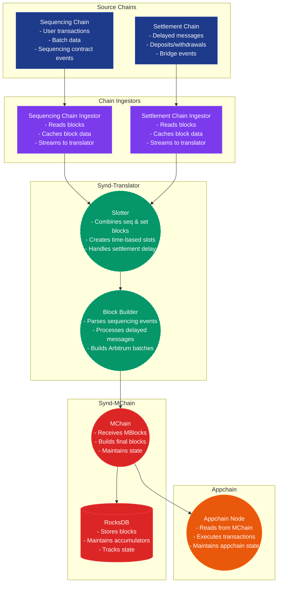
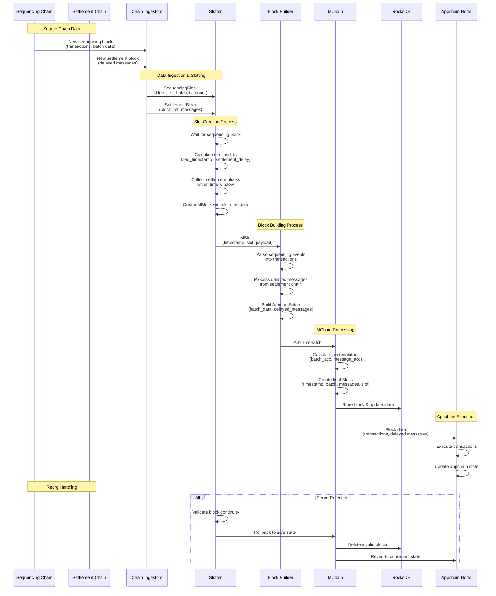

# `Synd-translator`

This is a service that ingests L2 transaction data, organizes the data into slots, builds blocks from the slots, and mines the blocks and makes them available to rollup frameworks.

It consists of a `common` crate and 2 component crates: `synd-slotter` and `synd-block-builder`. Additionally, the `synd-chain-ingestor` is a
standalone binary that is also required.

The `synd-mchain` server must be available at the `mchain` rpc url prior to starting the translator -
see the provided `documentation/local/docker-compose.yml` file for more information.

## System Architecture

The Syndicate translator system uses a dual-chain architecture where **sequencing** and **settlement** chains work together to derive appchain states.

### Architecture Overview



### Detailed Data Flow



### Key Components

#### Source Chains

- **Sequencing Chain**: Contains user transactions and batch data
- **Settlement Chain**: Contains delayed messages (deposits, withdrawals)

#### Chain Ingestors

- Read blocks from source chains
- Cache block data for fast access
- Stream data to translators

#### Slotter

- Combines sequencing and settlement blocks into time-based slots
- Handles settlement delay logic
- Creates MBlocks with slot metadata for reorg tracking

#### Block Builder

- Parses sequencing chain events into transactions
- Processes delayed messages from settlement chain
- Builds Arbitrum-compatible batches

#### MChain

- Receives MBlocks from slotter
- Calculates cryptographic accumulators
- Builds final blocks with state transitions
- Maintains chain state in RocksDB

#### Appchain node (nitro)

- Reads blocks from MChain
- Executes transactions
- Maintains appchain state

### Data Transformation Flow

1. **Raw Blocks** → **Parsed Events** → **Transactions/Messages**
2. **Time-based Slots** → **MBlocks** → **Final Blocks**
3. **Accumulators** → **State Proofs** → **Appchain State**

This architecture enables cost-effective sequencing while maintaining security and liquidity through the dual-chain approach.

## Mockchain configuration

The mockchain has chain id 511000 and a genesis timestamp of 0.

The rollup precompile is installed at 0x5FbDB2315678afecb367f032d93F642f64180aa3 with the following on-chain configuration:

```
{
   "chainId": 13331370,
   "homesteadBlock": 0,
   "daoForkBlock": null,
   "daoForkSupport": true,
   "eip150Block": 0,
   "eip150Hash": "0x0000000000000000000000000000000000000000000000000000000000000000",
   "eip155Block": 0,
   "eip158Block": 0,
   "byzantiumBlock": 0,
   "constantinopleBlock": 0,
   "petersburgBlock": 0,
   "istanbulBlock": 0,
   "muirGlacierBlock": 0,
   "berlinBlock": 0,
   "londonBlock": 0,
   "clique": {
      "period": 0,
      "epoch": 0
   },
   "arbitrum": {
      "EnableArbOS": true,
      "AllowDebugPrecompiles": false,
      "DataAvailabilityCommittee": false,
      "InitialArbOSVersion": 32,
      "InitialChainOwner": "0x0000000000000000000000000000000000000000",
      "GenesisBlockNum": 0
   }
}
```

## Rust configuration

Make sure you are using the nightly rust toolkit

```sh
rustup install nightly
rustup component add rustfmt --toolchain nightly
```

## Useful commands

(From `/synd-translator` directory)

Run all tests:

```sh
cargo test --all
```

Run unit tests

```sh
cargo test --lib
```

### Setup for integration tests

Our integration tests pull a Docker image from github which requires some authorization setup.

1. Make sure you have a Personal Access Token (PAT) on github with the `read:packagesDownload` permission

   - https://github.com/settings/tokens
   - Pro tip: Check under `~/.git-credentials` if you have one generated already

2. Run the following commands to login to Docker with the PAT

```sh
export CR_PAT="<GITHUB-PAT>"
echo $CR_PAT | docker login ghcr.io -u <GH_USERNAME> --password-stdin
```

`RUST_LOG` can also be `debug` or `trace` for more detail

Run

```sh
cargo make print-sample-command
```

to see the CLI options needed to run the binary executable, which utilizes the different component crates and dependencies
