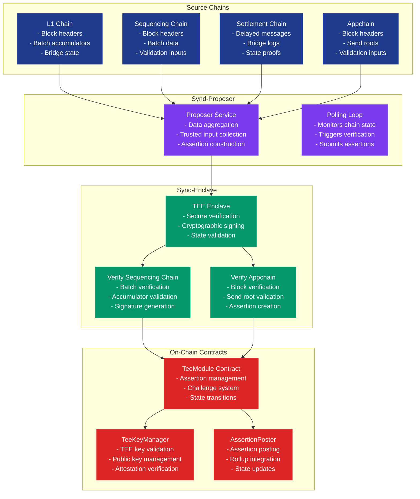
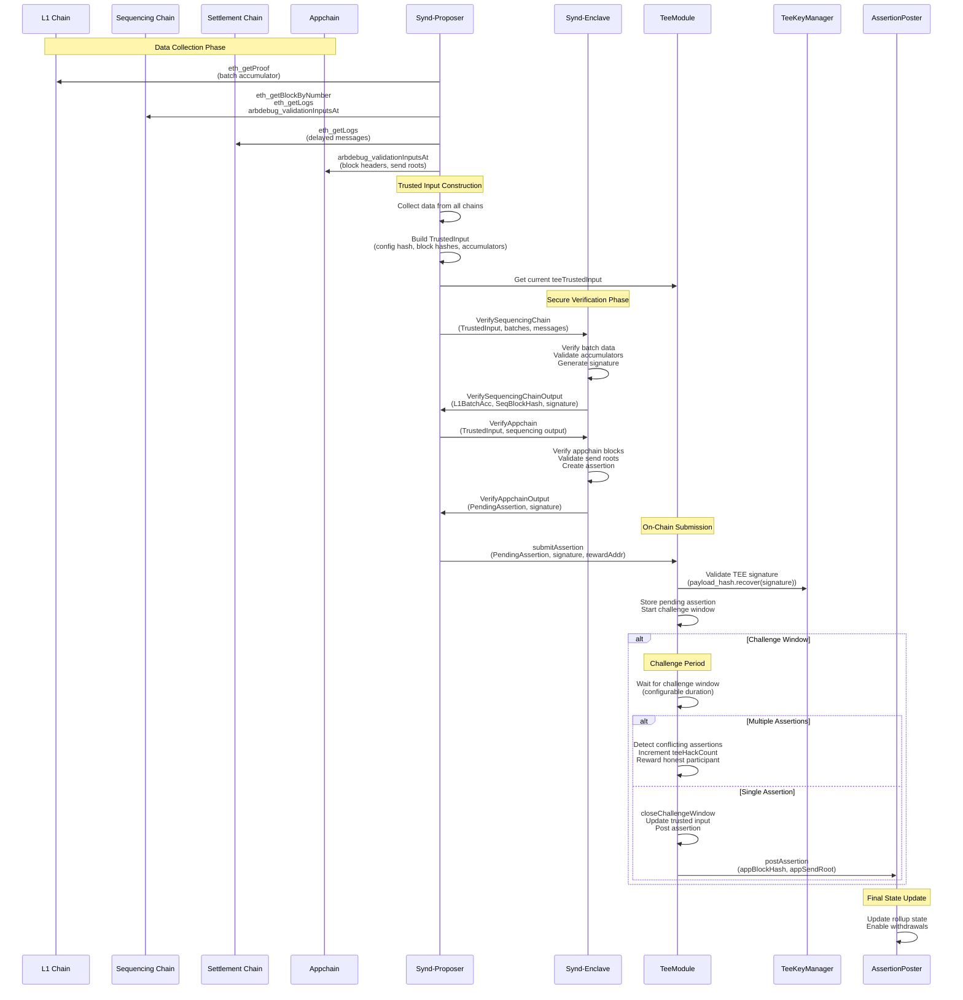

# Syndicate Withdrawals

This system manages the validation and submission of withdrawal proofs through a Trusted Execution Environment (TEE). It ingests data from multiple chains and nodes, performs secure verification inside an enclave, and submits validated proofs to on-chain contracts.

## System Architecture

The Syndicate withdrawal system uses a TEE-based architecture to securely validate and submit withdrawal proofs across multiple chains.

### Architecture Overview



### Detailed Withdrawal Flow



This architecture ensures secure, verifiable withdrawals while maintaining decentralization and trustlessness through cryptographic proofs and TEE-based verification.

---

## 🔒 System Guarantees & Assumptions

### **TEE Requirements**

- **Hardware Security**: All critical verification must be performed within a Trusted Execution Environment (TEE)
- **Attestation**: TEE instances provide cryptographic attestation documents
- **Key Management**: TEE instances securely manage private keys for signing assertions

### **Supported Platforms**

- **AWS Nitro Enclaves**: Currently the only supported TEE platform
- **Future Support**: Additional TEE platforms (Azure, GCP, etc.) are planned

### **Challenge System**

- **Challenge Window**: Configurable time period during which disputes can be raised
- **Multiple Assertions**: If conflicting assertions are submitted during the challenge window:
  - The system detects the conflict and increments `teeHackCount`
  - Honest participants are rewarded
  - Malicious behavior is penalized
- **Single Assertion**: If only one assertion is submitted, it's finalized after the challenge window

### **Security Assumptions**

- **TEE Integrity**: The TEE hardware and firmware are trusted and secure
- **Network Security**: Communication between components is secure (TLS for enclave communication)
- **Key Compromise**: If TEE keys are compromised, the system can detect and respond
- **Chain Reorgs**: The system handles chain reorganizations through reorg detection

### **Performance Characteristics**

- **Verification Time**: TEE verification adds latency but ensures security
- **Challenge Duration**: Configurable challenge windows (typically 10 mins)
- **Gas Costs**: On-chain operations incur gas costs for assertion submission
- **Throughput**: Limited by TEE verification speed and on-chain gas limits

### **User Considerations**

- **Withdrawal Timing**: Withdrawals require waiting for challenge window completion
- **TEE Dependency**: System availability depends on TEE infrastructure
- **Cross-Chain**: Withdrawals involve multiple chains (L1, sequencing, settlement, appchain)

---

## 🧩 Overview of Components

### 🔹 Source Chains

**Role:** Provide the raw data needed for withdrawal verification.

- **L1 Chain**: Provides batch accumulators and bridge state via `eth_getProof`
- **Sequencing Chain**: Contains batch data and validation inputs via `eth_getBlockByNumber`, `eth_getLogs`, `eth_getProof`, `arbdebug_validationInputsAt`
- **Settlement Chain**: Contains delayed messages and bridge logs via `eth_getLogs`
- **Appchain**: Provides block headers and send roots via `arbdebug_validationInputsAt`

### 🔹 `Synd-Proposer`

**Role:** Orchestrates the full withdrawal flow.  
**Main responsibilities:**

- **Data Aggregation**: Collects data from all source chains
- **Trusted Input Construction**: Builds secure input for TEE verification
- **Assertion Management**: Orchestrates the complete withdrawal flow
- **Polling Loop**: Monitors chain state and triggers verification

**Data aggregation** from multiple sources:

- **L1 node:** `eth_getProof`
- **Settlement node:** `eth_getLogs`
- **Sequencing node:** `eth_getBlockByNumber`, `eth_getLogs`, `eth_getProof`, `arbdebug_validationInputsAt`
- **Appchain node:** `arbdebug_validationInputsAt`

**Workflow:**

1. Constructs a `PendingAssertion` using collected data.
2. Invokes the secure TEE module to verify the assertion.
3. Submits the verified assertion on-chain via:
   - `submitPendingAssertion` → `TEEModule.sol`

### 🔹 `Synd-Enclave`

**Role:** Secure enclave runtime that performs the core logic for withdrawal proof validation.  
**Codebase:** Forked from [base/op-enclave](https://github.com/base/op-enclave)

**Main responsibilities:**

- **Secure Verification**: Performs cryptographic verification in TEE
- **Sequencing Chain Verification**: Validates batch data and accumulators
- **Appchain Verification**: Validates block headers and send roots
- **Signature Generation**: Creates cryptographically signed assertions

#### 🚀 Running the Enclave

There are two supported execution modes:

##### ➤ Local Execution (Development Mode)

1. Build the enclave binary:
   ```bash
   go build -C cmd/enclave
   ```
2. Run the enclave:
   ```bash
   ./cmd/enclave/enclave [--local]
   ```

### 🔹 On-Chain Contracts

**Role:** Manage the assertion lifecycle and provide security guarantees.

#### `TeeModule`

- **Assertion Management**: Manages assertion lifecycle and challenge system
- **Challenge System**: Handles disputes during challenge windows
- **State Transitions**: Manages trusted input updates and state transitions

#### `TeeKeyManager`

- **TEE Key Validation**: Validates TEE signatures and public keys
- **Public Key Management**: Manages authorized TEE public keys
- **Attestation Verification**: Verifies TEE attestation documents

#### `AssertionPoster`

- **Assertion Posting**: Posts verified assertions to rollups
- **Rollup Integration**: Integrates with Arbitrum rollup contracts
- **State Updates**: Updates rollup state to enable withdrawals

### 🔹 `Synd-Tee-Attestation-ZK-Proofs`

**Role:** Handles generation and verification of zk-SNARKs for attestation documents produced by `synd-enclave`.

### Security Features

1. **TEE-Based Verification**: All critical verification happens in secure enclave
2. **Cryptographic Signatures**: All assertions are signed by verified TEE instances
3. **Challenge System**: Disputes can be raised during challenge windows
4. **Hack Detection**: Multiple conflicting assertions trigger security measures
5. **Attestation Verification**: TEE attestation documents are cryptographically verified

### Data Flow

1. **Data Collection** → **Trusted Input** → **TEE Verification**
2. **Sequencing Verification** → **Appchain Verification** → **Assertion Creation**
3. **Signature Validation** → **Challenge Window** → **State Update**

---

## 🐳 Docker

To build a Docker image for the `synd-enclave` in a compatible environment:

```bash
docker build -f synd-withdrawals/synd-enclave/Dockerfile . --platform linux/amd64
```

---
